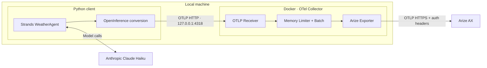

# Strands Agent → OpenTelemetry Collector → Arize AX

**A Python sample that sends traces from a local AI agent to Arize AX through a Docker-based OpenTelemetry Collector.**

A Strands `WeatherAgent` powered by Anthropic Claude Haiku calls a weather tool. The client converts agent, model, and tool spans to OpenInference format and sends them to the Collector, which handles batching and authenticated export to Arize.

> The weather tool returns fixed sample data. It does not call a live weather API. Model responses use the Anthropic API.

## Architecture



| Component | Responsibility |
| --- | --- |
| Strands Agent | Calls the model, executes tools, and generates native OpenTelemetry spans |
| OpenInference processor | Converts Strands spans to AGENT, CHAIN, LLM, and TOOL semantic conventions |
| Python OTLP exporter | Sends converted spans to the local Collector |
| OTel Collector | Receives spans, limits memory usage, batches, retries, and exports to Arize with authentication |
| Arize AX | Displays traces, parent-child relationships, inputs, outputs, and errors |

The client selects its destination using the `arize-space-id` OTLP request header. The Collector preserves that header and adds its own `authorization` credential. The client supplies the project name through the `openinference.project.name` resource attribute. The Collector API key must have access to every destination Space.

## Quick start

### 1. Prerequisites

- Python **3.11 or later** and `uv`
- A running Docker engine and Docker Compose
- An Anthropic API key
- An Arize AX API key and Space ID

The examples below use `docker-compose`. If your environment uses the Docker Compose plugin, replace it with `docker compose`.

### 2. Clone the repository and install dependencies

```sh
git clone https://github.com/seanlee10/arize-strand-via-otel.git
cd arize-strand-via-otel
uv sync --locked

# First-time setup: preserve an existing .env file.
cp -n .env.example .env
```

### 3. Configure API keys

Open `.env` and fill in these three values:

```dotenv
ANTHROPIC_API_KEY=your-anthropic-api-key
ARIZE_API_KEY=your-arize-api-key
ARIZE_SPACE_ID=your-arize-space-id
```

`ARIZE_SPACE_ID` must contain the **Space ID**, not the space name. Find it in Arize Space Settings. The `.env` file is excluded from Git.

The defaults are `claude-haiku-4-5-20251001` for the model, `strands-agent-sample` for the project, and the **US region** for Arize.

### 4. Start the Collector

```sh
# Validate environment variables and Collector configuration.
docker-compose config --quiet
docker-compose run --rm --no-deps otel-collector validate --config=/etc/otelcol-contrib/config.yaml

# Start in the background.
docker-compose up -d

# Check readiness. Retry after a short delay if the container just started.
curl --fail http://127.0.0.1:13133/
```

The health endpoint returns `"status":"Server available"` when the Collector is running.

### 5. Run the agent

```sh
uv run agent.py "What's the weather in Seoul?"
```

The agent calls `get_weather` and describes the sample weather for Seoul: **sunny, 22°C**. The current system prompt instructs the agent to answer in Korean; edit `system_prompt` in `agent.py` to change the response language. Exact wording may vary.

### 6. Verify traces in Arize

Sign in to [Arize AX](https://app.arize.com), select your configured Space, and open the `strands-agent-sample` project. Inspect the latest trace for:

- `invoke_agent WeatherAgent`: the request and final response
- `chat`: model calls and responses
- `execute_tool get_weather`: tool arguments and results
- `execute_event_loop_cycle`: agent processing steps

An end-to-end run through the Collector produced **1 AGENT, 2 CHAIN, 2 LLM, and 1 TOOL span**: **6 spans**, all with status `OK`. Inputs, outputs, and parent-child relationships were verified. Actual span counts can vary with tool calls and retries.

```sh
# Inspect received span counts and export errors.
docker-compose logs --tail=50 otel-collector
```

The health response shows Collector availability, and debug span counts show local receipt and pipeline processing. **Verify ingestion separately in Arize.**

## Environment variables

| Variable | Used by | Default / description |
| --- | --- | --- |
| `ANTHROPIC_API_KEY` | Python | Required: API key for model calls |
| `ANTHROPIC_MODEL` | Python | `claude-haiku-4-5-20251001` |
| `OTEL_EXPORTER_OTLP_TRACES_ENDPOINT` | Python | `http://127.0.0.1:4318/v1/traces` |
| `ARIZE_PROJECT_NAME` | Python | `strands-agent-sample` |
| `ARIZE_API_KEY` | Collector | Required: API key for Arize export |
| `ARIZE_SPACE_ID` | Python | Destination Space ID, sent in the `arize-space-id` header |
| `ARIZE_COLLECTOR_ENDPOINT` | Collector | `https://otlp.arize.com/v1/traces` — US |

For convenience, the sample uses a single `.env` file. Python configuration validation requires the Anthropic key. A valid Space ID is also needed for trace export; without it, the agent runs with export disabled and logs a warning. Compose passes only `ARIZE_API_KEY` and `ARIZE_COLLECTOR_ENDPOINT` to the Collector container. Existing shell environment variables take precedence over `.env`.

`OTEL_EXPORTER_OTLP_TRACES_ENDPOINT` and `ARIZE_COLLECTOR_ENDPOINT` configure separate hops. Both use a **full HTTP URL**, including `/v1/traces`.

## Route different agents to different Spaces

Each client process chooses its Space ID. Both clients below use the same Collector:

```sh
# Agent deployment A
uv run agent.py --space-id "$SPACE_A_ID" --project-name agent-a "What is the weather in Seoul?"

# Agent deployment B
uv run agent.py --space-id "$SPACE_B_ID" --project-name agent-b "What is the weather in London?"
```

Set `SPACE_A_ID` and `SPACE_B_ID` to your actual Space IDs before running these examples.
Alternatively, set `ARIZE_SPACE_ID` and `ARIZE_PROJECT_NAME` independently in each deployment.
CLI options override the corresponding environment variables. Changing a client's destination
requires restarting that client, not restarting or changing the Collector.

The routing path is:

1. Python sets `headers={"arize-space-id": target}` on its OTLP exporter.
2. The OTLP receiver uses `include_metadata: true` to retain the header.
3. `attributes/routing` copies the header into `arize.space_id` on each span for inspection,
   replacing any payload-supplied value. The header is the authoritative route.
4. `filter/require_space` drops absent, empty, or malformed routes from the Arize pipeline.
5. `batch.metadata_keys: [arize-space-id]` separates batches by Space ID.
6. `headers_setter/arize` reads `from_context: arize-space-id` and attaches that header to
   the outgoing Arize request. The Arize API key remains in the Collector.

There is **no default Space** in the Collector. The syntax check accepts base64-shaped IDs;
it does not prove that a Space exists or that the key can access it. Arize validates access.
A resource/span attribute alone does not route requests in this configuration.
`headers_setter.from_attribute` refers to receiver authentication data, not arbitrary payload attributes.

This sample supports **one immutable Space per Python process**. Do not modify shared exporter
headers or environment variables between concurrent agent calls. Multiple destinations within
one Python process require per-operation routing and separate export batches; that client mode
is not implemented here.

When adapting a shared observability Collector, apply these processors to the **Arize branch**
and retain existing observability pipelines. Route the full agent execution, including AGENT,
CHAIN, LLM, and TOOL spans. Keep `include_metadata` and per-space batching together, and do not
add processors that discard request metadata or merge spaces later in the pipeline.
Exporter queue batching is intentionally not enabled; enabling it requires equivalent metadata partitioning.
The sample limits active batch metadata combinations to 100 for the Collector lifetime.

A client-provided Space ID is a routing hint, not an authorization boundary. In a shared deployment,
authenticate clients and restrict which Spaces each identity may select. This localhost sample
assumes trusted clients and one Collector API key authorized for all target Spaces.

### Collector routing integration test

```sh
RUN_COLLECTOR_TESTS=1 uv run python -m unittest discover -s tests -v
```

This opt-in test starts an isolated Collector and a mock OTLP upstream in Docker, using synthetic
Space IDs and a dummy API key. It sends concurrent traffic for two Spaces, forces a retry for each,
and verifies that no batch crosses Spaces. It also checks that missing, empty, and malformed
headers are dropped, payload routing attributes cannot override headers, and client authorization
is not forwarded. Test containers and their network are removed afterward. The first run may
pull `python:3.11-alpine` and the pinned Collector image. No real Arize credentials are used.

## Project layout

```text
.
├── agent.py                # Haiku model, WeatherAgent, and get_weather tool
├── instrumentation.py      # OpenInference conversion and local OTLP export
├── compose.yaml            # Collector container, ports, and environment
├── otel-collector.yaml      # Receiver → Processors → Exporters pipeline
├── .env.example            # Environment variable template
├── pyproject.toml          # Python dependencies
├── uv.lock                 # Locked dependency versions
└── tests/
    ├── test_tracing.py           # Client instrumentation and route validation
    ├── test_collector_routing.py # Opt-in Docker routing and retry test
    └── fixtures/otlp_sink.py     # Mock upstream for the Docker test
```

## Tracing implementation

**Client:** `StrandsAgentsToOpenInferenceProcessor` → `BatchSpanProcessor` → OTLP HTTP exporter. The converter mutates spans in place, so it is registered before the exporter. The global `TracerProvider` is configured before the agent is created.

**Collector:** OTLP receiver → `memory_limiter` → routing metadata → missing/invalid-space filter → per-space `batch` → Arize exporter. The debug exporter logs basic span counts. The Collector image is pinned to `otel/opentelemetry-collector-contrib:0.160.0`.

**Wire format:** The Arize HTTP exporter uses `compression: none`. In the tested environment, default gzip export was rejected with HTTP 400 (`cannot parse invalid wire-format data`). Uncompressed protobuf export succeeded.

**Shutdown:** Python calls `force_flush()` and `shutdown()` even when an error occurs. This completes export to the Collector; the Collector handles its own batching and retries separately.

## Operational commands

```sh
# Check container status.
docker-compose ps

# Follow logs.
docker-compose logs -f otel-collector

# Recreate after changing Collector configuration or Arize credentials.
docker-compose up -d --force-recreate

# Stop and remove the container and Compose network.
docker-compose down
```

| Host address | Purpose |
| --- | --- |
| `127.0.0.1:4318` | OTLP HTTP — used by the Python sample |
| `127.0.0.1:4317` | OTLP gRPC — available for other clients |
| `127.0.0.1:13133` | Collector health endpoint |

Host ports are exposed only on localhost. If you move the client into a container on the same Compose network, set its export URL to `http://otel-collector:4318/v1/traces`.

This configuration is intended for local experimentation. The Collector uses an in-memory queue and retries for up to 60 seconds. No persistent queue is configured, so forced shutdowns or extended export failures can cause queued data to be lost.

## Tests

```sh
uv run python -m unittest discover -s tests -v
```

Tests use a fake model and a local HTTP receiver. No API keys, running Collector, or external API calls are required. They execute a real Strands agent loop and check:

- AGENT, LLM, and TOOL spans with inputs and outputs after OpenInference conversion
- A shared trace ID and valid parent-child relationships
- The OTLP path and project resource attribute
- Use of the local endpoint with the selected Space ID header and without an Arize API key
- Missing or malformed client routes disable export without falling back to another Space

Verify export through the Docker Collector to Arize separately using the quick-start steps above.

## Troubleshooting

| Symptom | What to check |
| --- | --- |
| `docker: unknown command: docker compose` | Use the `docker-compose` command. |
| `connection refused` | Check Docker and Collector status, port 4318, and the client endpoint. |
| Port already in use | Check for conflicts on ports 4317, 4318, and 13133. If you change the host HTTP port, update the client endpoint too. |
| Arize export returns 401/403 | Check the client's Space ID and whether the Collector's API key has access to that Space. |
| HTTP 400 / `invalid wire-format data` | Check `compression: none` and the full URL ending in `/v1/traces`. |
| Model API quota or credit error | Check the Anthropic API key, available credits, and usage limits. Execution may fail before the tool runs. |
| Collector is running but Arize shows no traces | Check Collector export errors, the client Space ID, Arize project, region, and the UI time range. Missing routing headers are dropped. |
| Changes to `.env` do not take effect | Check for overriding shell environment variables. Recreate the container after changing Collector settings. |

## References

- [Arize AX: Strands integration](https://arize.com/docs/ax/integrations/python-agent-frameworks/aws-strands/aws-strands-tracing)
- [OpenTelemetry Collector configuration](https://opentelemetry.io/docs/collector/configuration/)
- [OTLP HTTP exporter](https://github.com/open-telemetry/opentelemetry-collector/blob/main/exporter/otlphttpexporter/README.md)
- [Anthropic models](https://platform.claude.com/docs/en/models/overview)

- [Collector header forwarding](https://github.com/open-telemetry/opentelemetry-collector-contrib/blob/v0.160.0/extension/headerssetterextension/README.md)
