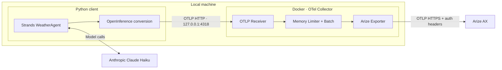

# Strands Agent → OpenTelemetry Collector → Arize AX

**A Python sample that sends traces from a local AI agent to Arize AX through a Docker-based OpenTelemetry Collector.**

A Strands `WeatherAgent` powered by Anthropic Claude Haiku calls a weather tool. The client converts agent, model, and tool spans to OpenInference format and sends them to the Collector, which batches them and exports them to Arize using the credential the client supplied.

> The weather tool returns fixed sample data. It does not call a live weather API. Model responses use the Anthropic API.

## Architecture



| Component | Responsibility |
| --- | --- |
| Strands Agent | Calls the model, executes tools, and generates native OpenTelemetry spans |
| OpenInference processor | Converts Strands spans to AGENT, CHAIN, LLM, and TOOL semantic conventions |
| Python OTLP exporter | Sends converted spans to the local Collector |
| OTel Collector | Receives spans, limits memory usage, batches per destination, retries, and relays to Arize with the client's credential |
| Arize AX | Displays traces, parent-child relationships, inputs, outputs, and errors |

The client selects its destination with the `space_id` OTLP request header and authenticates with the `arize_api_key` header. The Collector renames them to the pair Arize's HTTP endpoint expects (`arize-space-id` and `authorization`) and stores neither, so it holds no credential of its own. The client supplies the project name through the `openinference.project.name` resource attribute. Each client's API key must have access to the Space it selects.

## Quick start

### 1. Prerequisites

- Python **3.11 or later** and `uv`
- A running Docker engine and Docker Compose
- An Anthropic API key
- An Arize AX API key and the Space ID it can write to

The examples below use `docker-compose`. If your environment uses the Docker Compose plugin, replace it with `docker compose`.

### 2. Clone the repository and install dependencies

```sh
git clone https://github.com/seanlee10/arize-strand-via-otel.git
cd arize-strand-via-otel
uv sync --locked

# First-time setup: preserve an existing .env file.
cp -n .env.example .env
```

### 3. Configure API keys

Open `.env` and fill in these three values:

```dotenv
ANTHROPIC_API_KEY=your-anthropic-api-key
ARIZE_API_KEY=your-arize-api-key
ARIZE_SPACE_ID=your-arize-space-id
```

`ARIZE_SPACE_ID` must contain the **Space ID**, not the space name. Find it in Arize Space Settings. Both Arize values belong to the Python client, which sends them with every export request. The `.env` file is excluded from Git.

The defaults are `claude-haiku-4-5-20251001` for the model, `strands-agent-sample` for the project, and the **US region** for Arize.

### 4. Start the Collector

```sh
# Validate environment variables and Collector configuration.
docker-compose config --quiet
docker-compose run --rm --no-deps otel-collector validate --config=/etc/otelcol-contrib/config.yaml

# Start in the background.
docker-compose up -d

# Check readiness. Retry after a short delay if the container just started.
curl --fail http://127.0.0.1:13133/
```

The health endpoint returns `"status":"Server available"` when the Collector is running.

### 5. Run the agent

```sh
uv run agent.py "What's the weather in Seoul?"
```

The agent calls `get_weather` and describes the sample weather for Seoul: **sunny, 22°C**. The current system prompt instructs the agent to answer in Korean; edit `system_prompt` in `agent.py` to change the response language. Exact wording may vary.

### 6. Verify traces in Arize

Sign in to [Arize AX](https://app.arize.com), select your configured Space, and open the `strands-agent-sample` project. Inspect the latest trace for:

- `invoke_agent WeatherAgent`: the request and final response
- `chat`: model calls and responses
- `execute_tool get_weather`: tool arguments and results
- `execute_event_loop_cycle`: agent processing steps

An end-to-end run through the Collector produced **1 AGENT, 2 CHAIN, 2 LLM, and 1 TOOL span**: **6 spans**, all with status `OK`. Inputs, outputs, and parent-child relationships were verified. Actual span counts can vary with tool calls and retries.

```sh
# Inspect received span counts and export errors.
docker-compose logs --tail=50 otel-collector
```

The health response shows Collector availability, and debug span counts show local receipt and pipeline processing. **Verify ingestion separately in Arize.**

## Environment variables

| Variable | Used by | Default / description |
| --- | --- | --- |
| `ANTHROPIC_API_KEY` | Python | Required: API key for model calls |
| `ANTHROPIC_MODEL` | Python | `claude-haiku-4-5-20251001` |
| `OTEL_EXPORTER_OTLP_TRACES_ENDPOINT` | Python | `http://127.0.0.1:4318/v1/traces` |
| `ARIZE_PROJECT_NAME` | Python | `strands-agent-sample` |
| `ARIZE_API_KEY` | Python | Required for export: sent in the `arize_api_key` header |
| `ARIZE_SPACE_ID` | Python | Destination Space ID, sent in the `space_id` header |
| `ARIZE_COLLECTOR_ENDPOINT` | Collector | `https://otlp.arize.com/v1/traces` — US, HTTP leg |
| `ARIZE_COLLECTOR_GRPC_ENDPOINT` | Collector | `otlp.arize.com:443` — US, gRPC leg |
| `OTEL_EXPORTER_OTLP_PROTOCOL` | Python | `http/protobuf` (default) or `grpc` |

For convenience, the sample uses a single `.env` file. Python configuration validation requires the Anthropic key. A valid Space ID **and** API key are also needed for trace export; without either, the agent runs with export disabled and logs a warning naming the missing setting. Compose passes only `ARIZE_COLLECTOR_ENDPOINT` to the Collector container. Existing shell environment variables take precedence over `.env`.

`OTEL_EXPORTER_OTLP_TRACES_ENDPOINT` and `ARIZE_COLLECTOR_ENDPOINT` configure separate hops. Both use a **full HTTP URL**, including `/v1/traces`.

## Send a trace without calling a model

`mock_trace.py` runs the same agent loop, OpenInference conversion, and export
headers as `agent.py`, but replaces the model with a deterministic stand-in. The span
tree is identical — AGENT, CHAIN, LLM, and TOOL — so it exercises the whole Collector
path without spending model credits. Use it to prove an endpoint accepts traffic.

```sh
# Through the local Collector
uv run mock_trace.py

# Straight to Arize, bypassing the Collector, to isolate which hop is broken
uv run mock_trace.py --endpoint https://otlp.arize.com/v1/traces

# A specific destination
uv run mock_trace.py --space-id "$SPACE_B_ID" --project-name probe-b
```

It prints the endpoint it used and the trace ID it produced, so the trace can be
looked up directly. Exit codes: `0` flushed, `1` flush timed out, `2` no usable route,
in which case nothing is exported. A completed flush proves the request left the
client, not that Arize ingested it.

## Run the gRPC leg instead of HTTP

The default path is HTTP on both hops. A gRPC variant overlays only the Arize-facing
pieces; receivers, processors, and routing rules are inherited from the base config.

```sh
docker-compose -f compose.yaml -f compose.grpc.yaml up -d --force-recreate

OTEL_EXPORTER_OTLP_PROTOCOL=grpc \
OTEL_EXPORTER_OTLP_TRACES_ENDPOINT=http://127.0.0.1:4317 \
  uv run mock_trace.py
```

Both halves must move together. A gRPC endpoint is `host:port` with no signal path;
an HTTP one is the full `/v1/traces` URL. Pointing one transport at the other's
endpoint fails silently — the Collector refuses to start if a gRPC endpoint carries
a path, but a gRPC client against an HTTP listener just gets nothing.

| | HTTP leg | gRPC leg |
| --- | --- | --- |
| Client env | `OTEL_EXPORTER_OTLP_PROTOCOL` unset | `=grpc` |
| Client endpoint | `http://127.0.0.1:4318/v1/traces` | `http://127.0.0.1:4317` |
| Collector exporter | `otlp_http/arize` | `otlp/arize` |
| Arize endpoint | `https://otlp.arize.com/v1/traces` | `otlp.arize.com:443` |
| Forwarded header names | `arize-space-id` / `authorization` | `space_id` / `api_key` |

Measured against `otlp.arize.com` on 2026-09-22: the gRPC endpoint accepts **either**
header pair. `space_id`/`api_key` and `arize-space-id`/`authorization` both ingested a
full six-span trace. The names in the table are the per-transport convention, not a
constraint the endpoint enforces. Do not assume a header-name mismatch explains missing
traces without testing it.

The client sends `space_id` and `arize_api_key` on both transports; only the Collector's
`headers_setter` mapping differs. gRPC metadata keys must be lowercase, which both are.

## Route different agents to different Spaces

Each client process chooses its Space ID and carries its own API key. Both clients below use
the same Collector:

```sh
# Agent deployment A
ARIZE_API_KEY="$KEY_A" uv run agent.py --space-id "$SPACE_A_ID" --project-name agent-a "What is the weather in Seoul?"

# Agent deployment B
ARIZE_API_KEY="$KEY_B" uv run agent.py --space-id "$SPACE_B_ID" --project-name agent-b "What is the weather in London?"
```

Set these variables to your actual Space IDs and keys before running the examples. Alternatively,
set `ARIZE_API_KEY`, `ARIZE_SPACE_ID`, and `ARIZE_PROJECT_NAME` independently in each deployment.
There is no `--api-key` option on purpose: command-line arguments are readable by any local
process through `ps`, so the credential stays in the environment. CLI options override the
corresponding environment variables. Changing a client's destination requires restarting that
client, not restarting or changing the Collector.

The routing path is:

1. Python sets `headers={"space_id": target, "arize_api_key": key}` on its OTLP exporter.
2. The OTLP receiver uses `include_metadata: true` to retain both headers.
3. `attributes/routing` copies them into `arize.space_id` and `arize.auth` on each span,
   replacing any payload-supplied values. The headers are authoritative.
4. `filter/require_route` drops spans whose Space ID is absent, empty, or malformed, and spans
   with no credential, from the Arize pipeline.
5. `attributes/redact` deletes `arize.auth` immediately after the filter, so the credential never
   reaches the batcher, an exporter, or the debug log. `arize.space_id` stays for inspection.
6. `batch.metadata_keys: [space_id, arize_api_key]` separates batches by destination and
   credential, so one client's spans can never be exported under another's key.
7. `headers_setter/arize` reads both values `from_context` and renames them for the outgoing
   Arize request: `space_id` becomes `arize-space-id` and `arize_api_key` becomes
   `authorization`. The client never needs to know Arize's own header names, and switching the
   Collector to a gRPC exporter would change only this mapping (`space_id` and `api_key`).

There is **no default Space and no default credential** in the Collector. The syntax check accepts
base64-shaped IDs; it does not prove that a Space exists or that the key can access it. Arize
validates access.
A resource/span attribute alone does not route requests in this configuration.
`headers_setter.from_attribute` refers to receiver authentication data, not arbitrary payload attributes.

This sample supports **one immutable Space per Python process**. Do not modify shared exporter
headers or environment variables between concurrent agent calls. Multiple destinations within
one Python process require per-operation routing and separate export batches; that client mode
is not implemented here.

When adapting a shared observability Collector, apply these processors to the **Arize branch**
and retain existing observability pipelines. Route the full agent execution, including AGENT,
CHAIN, LLM, and TOOL spans. Keep `include_metadata` and per-space batching together, and do not
add processors that discard request metadata or merge spaces later in the pipeline.
Exporter queue batching is intentionally not enabled; enabling it requires equivalent metadata partitioning.
The sample limits active batch metadata combinations to 100 for the Collector lifetime.

Because the credential now travels with each request, the Collector is a relay rather than an
authorization boundary: it forwards whatever key it is handed and cannot contain a misbehaving
client. Arize is the only thing that checks whether a key may write to the selected Space, so a
client can reach any Space its own key permits. In a shared deployment, authenticate clients at
the Collector's ingress and issue a separate, narrowly scoped Arize key per client. This localhost
sample assumes trusted clients.

### Collector routing integration test

```sh
RUN_COLLECTOR_TESTS=1 uv run python -m unittest discover -s tests -v
```

This opt-in test starts an isolated Collector and a mock OTLP upstream in Docker, using synthetic
Space IDs and dummy API keys. It sends concurrent traffic for two Spaces with a different key each,
forces a retry for each, and verifies that no batch crosses Spaces or credentials. It also checks
that the Collector renames both headers for the upstream request, that missing, empty, and
malformed routing headers are dropped, that a valid Space ID without a
credential is dropped, that payload attributes cannot override or substitute for headers, and that
the credential is not exported as a span attribute. Test containers and their network are removed
afterward. The first run may pull `python:3.11-alpine` and the pinned Collector image. No real
Arize credentials are used.

## Project layout

```text
.
├── agent.py                # Haiku model, WeatherAgent, and get_weather tool
├── mock_trace.py           # One trace with a fake model: no model API call
├── instrumentation.py      # OpenInference conversion and local OTLP export
├── compose.yaml            # Collector container, ports, and environment
├── compose.grpc.yaml       # Overlay: run the Arize leg over gRPC
├── otel-collector-grpc.yaml # Overlay: gRPC exporter and header mapping
├── otel-collector.yaml      # Receiver → Processors → Exporters pipeline
├── .env.example            # Environment variable template
├── pyproject.toml          # Python dependencies
├── uv.lock                 # Locked dependency versions
└── tests/
    ├── test_tracing.py           # Client instrumentation and route validation
    ├── test_collector_routing.py # Opt-in Docker routing and retry test
    └── fixtures/otlp_sink.py     # Mock upstream for the Docker test
```

## Tracing implementation

**Client:** `StrandsAgentsToOpenInferenceProcessor` → `BatchSpanProcessor` → OTLP HTTP exporter. The converter mutates spans in place, so it is registered before the exporter. The global `TracerProvider` is configured before the agent is created.

**Collector:** OTLP receiver → `memory_limiter` → routing metadata → missing/invalid-space filter → per-space `batch` → Arize exporter. The debug exporter logs basic span counts. The Collector image is pinned to `otel/opentelemetry-collector-contrib:0.160.0`.

**Wire format:** The Arize HTTP exporter uses `compression: none`. In the tested environment, default gzip export was rejected with HTTP 400 (`cannot parse invalid wire-format data`). Uncompressed protobuf export succeeded.

**Shutdown:** Python calls `force_flush()` and `shutdown()` even when an error occurs. This completes export to the Collector; the Collector handles its own batching and retries separately.

## Operational commands

```sh
# Check container status.
docker-compose ps

# Follow logs.
docker-compose logs -f otel-collector

# Recreate after changing Collector configuration or Arize credentials.
docker-compose up -d --force-recreate

# Stop and remove the container and Compose network.
docker-compose down
```

| Host address | Purpose |
| --- | --- |
| `127.0.0.1:4318` | OTLP HTTP — used by the Python sample |
| `127.0.0.1:4317` | OTLP gRPC — available for other clients |
| `127.0.0.1:13133` | Collector health endpoint |

Host ports are exposed only on localhost. If you move the client into a container on the same Compose network, set its export URL to `http://otel-collector:4318/v1/traces`.

This configuration is intended for local experimentation. The Collector uses an in-memory queue and retries for up to 60 seconds. No persistent queue is configured, so forced shutdowns or extended export failures can cause queued data to be lost.

## Tests

```sh
uv run python -m unittest discover -s tests -v
```

Tests use `mock_trace.MockModel` and a local HTTP receiver. No API keys, running Collector, or external API calls are required. They execute a real Strands agent loop and check:

- AGENT, LLM, and TOOL spans with inputs and outputs after OpenInference conversion
- A shared trace ID and valid parent-child relationships
- The OTLP path and project resource attribute
- Use of the local endpoint with the `space_id` and `arize_api_key` request headers
- A missing or malformed Space ID or API key disables export without falling back to the environment

Verify export through the Docker Collector to Arize separately using the quick-start steps above.

## Troubleshooting

| Symptom | What to check |
| --- | --- |
| `docker: unknown command: docker compose` | Use the `docker-compose` command. |
| `connection refused` | Check Docker and Collector status, port 4318, and the client endpoint. |
| Port already in use | Check for conflicts on ports 4317, 4318, and 13133. If you change the host HTTP port, update the client endpoint too. |
| Arize export returns 401/403 | Check the client's Space ID and whether that client's API key has access to that Space. |
| HTTP 400 / `invalid wire-format data` | Check `compression: none` and the full URL ending in `/v1/traces`. |
| Model API quota or credit error | Check the Anthropic API key, available credits, and usage limits. Execution may fail before the tool runs. |
| Collector is running but Arize shows no traces | Check Collector export errors, the client Space ID and API key, Arize project, region, and the UI time range. Spans missing either routing header are dropped. |
| Changes to `.env` do not take effect | Check for overriding shell environment variables. Recreate the container after changing Collector settings. |

## References

- [Arize AX: Strands integration](https://arize.com/docs/ax/integrations/python-agent-frameworks/aws-strands/aws-strands-tracing)
- [OpenTelemetry Collector configuration](https://opentelemetry.io/docs/collector/configuration/)
- [OTLP HTTP exporter](https://github.com/open-telemetry/opentelemetry-collector/blob/main/exporter/otlphttpexporter/README.md)
- [Anthropic models](https://platform.claude.com/docs/en/models/overview)

- [Collector header forwarding](https://github.com/open-telemetry/opentelemetry-collector-contrib/blob/v0.160.0/extension/headerssetterextension/README.md)
