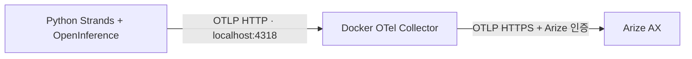

# Strands → 로컬 OpenTelemetry Collector → Arize AX

Claude Haiku 기반 `WeatherAgent`가 날씨 도구를 호출하고, 트레이스를 로컬 Docker
Collector를 거쳐 Arize AX US 리전으로 전송합니다. 날씨는 **샘플 데이터**입니다.



OpenInference 변환은 Python에서 수행합니다. Collector는 span을 배치 처리하고
Arize 인증 헤더를 붙여 전달합니다. Python 클라이언트는 Arize 키가 없어도 동작합니다.
프로젝트 이름은 클라이언트가 `openinference.project.name` resource 속성으로 전송합니다.

## 시작하기

Docker 엔진, Docker Compose, `uv`가 필요합니다. 이 환경은 `docker-compose`를 사용합니다.
Docker Desktop에서 Compose 플러그인을 사용한다면 아래 명령을 `docker compose`로 바꿔 실행하세요.

```sh
uv sync --locked
# 처음 설정할 때만 복사하세요. 기존 .env가 있으면 덮어쓰지 않습니다.
cp -n .env.example .env
```

`.env` 설정:

| 변수 | 사용처 | 값 |
| --- | --- | --- |
| `ANTHROPIC_API_KEY` | Python | Anthropic API 키 |
| `ANTHROPIC_MODEL` | Python | 기본 `claude-haiku-4-5-20251001` |
| `OTEL_EXPORTER_OTLP_TRACES_ENDPOINT` | Python | 기본 `http://127.0.0.1:4318/v1/traces` |
| `ARIZE_PROJECT_NAME` | Python | 기본 `strands-agent-sample` |
| `ARIZE_API_KEY` | Collector | Arize API 키 |
| `ARIZE_SPACE_ID` | Collector | 공간 이름이 아닌 Space ID |
| `ARIZE_COLLECTOR_ENDPOINT` | Collector | 기본 `https://otlp.arize.com/v1/traces` |

기존 `.env`의 Arize 설정은 그대로 사용합니다. 로컬 endpoint 변수가 없으면 코드의
기본값이 적용됩니다. 셸 환경 변수는 `.env`보다 우선합니다.
Compose는 Collector에 필요한 Arize 변수 3개만 컨테이너에 전달합니다.

```sh
# 설정 검사 (키가 출력되지 않는 옵션)
docker-compose config --quiet
docker-compose run --rm --no-deps otel-collector validate --config=/etc/otelcol-contrib/config.yaml

# Collector 시작
docker-compose up -d
curl --fail http://127.0.0.1:13133/

# 에이전트 실행
uv run agent.py "서울 날씨를 알려줘."

# Collector 수신/전송 오류 확인
docker-compose logs --tail=50 otel-collector
```

Arize의 `strands-agent-sample` 프로젝트에서 새 트레이스의 AGENT / CHAIN / LLM / TOOL
span과 입력·출력을 확인합니다. Collector health 응답이나 debug의 span 개수만으로
Arize 수신 성공을 판단하지 말고, Arize에서도 확인하세요.

## 포트와 처리 순서

- `127.0.0.1:4318`: OTLP HTTP receiver. Python 샘플이 사용합니다.
- `127.0.0.1:4317`: OTLP gRPC receiver. 다른 OTLP 클라이언트에 사용할 수 있습니다.
- `127.0.0.1:13133`: Collector health endpoint.

Docker 내부 receiver는 `0.0.0.0`에서 수신하고, 호스트 공개 포트는 localhost에만 바인딩합니다.
나중에 클라이언트도 동일 Compose 네트워크의 컨테이너로 옮기면 endpoint는
`http://otel-collector:4318/v1/traces`로 설정하세요.

Python의 처리 순서는 **OpenInference 변환 → BatchSpanProcessor → 로컬 OTLP exporter**입니다.
Collector의 처리 순서는 **OTLP receiver → memory_limiter → batch → Arize exporter**입니다.
Collector debug exporter는 개수만 기록하며 프롬프트·응답 전체를 기록하지 않습니다.

Python 종료 시 `force_flush()`와 `shutdown()`을 호출합니다. 이것은 Collector까지의
전송을 마무리하며, Collector는 별도로 배치와 재시도를 수행합니다.
Collector 재시도는 최대 60초이며 큐는 메모리에 있으므로 컨테이너 강제 종료 시
대기 중인 데이터가 사라질 수 있습니다. 로컬 샘플 구성에는 디스크 영속 큐가 없습니다.

## 중지와 설정 변경

```sh
# 설정/키 변경 후 재생성
docker-compose up -d --force-recreate

# 중지 및 컨테이너/네트워크 제거
docker-compose down
```

Arize에서 401/403이 발생하면 Collector에 전달된 키와 Space ID를 확인하세요.
클라이언트에서 connection refused가 발생하면 Collector 상태와 4318 포트를 확인하세요.
`traces_endpoint`에는 `/v1/traces`까지 포함된 전체 URL을 사용합니다.
Arize HTTP 전송은 `compression: none`으로 설정했습니다. 이 환경에서는 기본 gzip
전송이 HTTP 400 (`cannot parse invalid wire-format data`)으로 거절됐고,
비압축으로 변경한 후 Collector 경유 트레이스 6개가 모두 `OK`로 수신됐습니다.

## 테스트

```sh
uv run python -m unittest discover -s tests -v
```

외부 API 없이 실제 Strands agent loop를 가짜 모델로 실행하고, 로컬 OTLP 수신기로
OpenInference span·입력·출력·부모 관계를 검사합니다. 클라이언트 요청에 Arize 인증
헤더가 없고, Arize endpoint 대신 로컬 endpoint가 사용되는지도 확인합니다.
실제 Collector 경유와 Arize 수신은 위 실행 절차로 별도 확인합니다.

참고: [Collector 구성](https://opentelemetry.io/docs/collector/configuration/),
[OTLP HTTP exporter](https://github.com/open-telemetry/opentelemetry-collector/blob/main/exporter/otlphttpexporter/README.md),
[Arize Strands 연동](https://arize.com/docs/ax/integrations/python-agent-frameworks/aws-strands/aws-strands-tracing)
