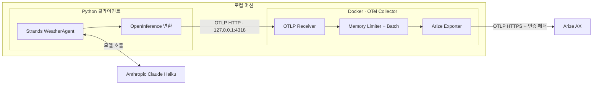

# Strands Agent → OpenTelemetry Collector → Arize AX

**로컬에서 실행하는 AI 에이전트의 트레이스를 Docker 기반 OpenTelemetry Collector를 거쳐 Arize AX로 보내는 Python 샘플입니다.**

Anthropic Claude Haiku를 사용하는 Strands `WeatherAgent`가 날씨 도구를 호출합니다. OpenInference로 변환한 에이전트·모델·도구 span을 Collector에 보내고, Collector가 Arize 인증과 배치 전송을 담당합니다.

> 날씨 도구는 고정된 샘플 데이터를 반환합니다. 실제 날씨 API는 호출하지 않으며, 모델 응답에는 Anthropic API를 사용합니다.

## 아키텍처



| 구성 요소 | 역할 |
| --- | --- |
| Strands Agent | 모델 호출, 도구 실행, 네이티브 OpenTelemetry span 생성 |
| OpenInference processor | Strands span을 AGENT·CHAIN·LLM·TOOL 의미 규약으로 변환 |
| Python OTLP exporter | 변환된 span을 로컬 Collector에 전송 |
| OTel Collector | span 수신, 메모리 제한, 배치, 재시도, Arize 인증 및 전송 |
| Arize AX | 트레이스와 부모·자식 관계, 입력·출력, 오류 확인 |

클라이언트는 Arize API 키 없이 동작합니다. Collector가 `authorization`과 `arize-space-id` 헤더를 붙입니다. 프로젝트 이름은 클라이언트의 `openinference.project.name` resource 속성으로 전달합니다.

## 빠른 시작

### 1. 준비

- Python **3.11 이상**과 `uv`
- 실행 중인 Docker 엔진과 Docker Compose
- Anthropic API 키
- Arize AX API 키와 Space ID

아래 예제는 `docker-compose`를 사용합니다. Docker Compose 플러그인을 사용하는 환경에서는 `docker compose`로 바꿔 실행하세요.

### 2. 저장소와 의존성 설치

```sh
git clone https://github.com/seanlee10/arize-strand-via-otel.git
cd arize-strand-via-otel
uv sync --locked

# 처음 설정할 때 실행합니다. 기존 .env가 있으면 덮어쓰지 않습니다.
cp -n .env.example .env
```

### 3. API 키 설정

`.env`를 열어 다음 세 값을 채웁니다.

```dotenv
ANTHROPIC_API_KEY=your-anthropic-api-key
ARIZE_API_KEY=your-arize-api-key
ARIZE_SPACE_ID=your-arize-space-id
```

`ARIZE_SPACE_ID`는 공간 이름이 아닌 **Space ID**입니다. Arize Space Settings에서 확인하세요. `.env`는 Git 추적에서 제외됩니다.

기본 모델은 `claude-haiku-4-5-20251001`, 프로젝트는 `strands-agent-sample`, Arize 전송 대상은 **US 리전**입니다.

### 4. Collector 실행

```sh
# 환경 변수와 Collector 설정 검사
docker-compose config --quiet
docker-compose run --rm --no-deps otel-collector validate --config=/etc/otelcol-contrib/config.yaml

# 백그라운드 실행
docker-compose up -d

# 기동 확인: 시작 직후라면 잠시 후 다시 실행하세요.
curl --fail http://127.0.0.1:13133/
```

health endpoint가 `"status":"Server available"`을 반환하면 Collector가 기동된 상태입니다.

### 5. 에이전트 실행

```sh
uv run agent.py "서울 날씨를 알려줘."
```

에이전트는 `get_weather`를 호출한 뒤 서울의 샘플 날씨인 **맑음, 22°C**를 한국어로 설명합니다. 응답 문구는 모델에 따라 달라질 수 있습니다.

### 6. Arize에서 확인

[Arize AX](https://app.arize.com)에 로그인해 설정한 Space와 `strands-agent-sample` 프로젝트를 선택합니다. 최근 트레이스에서 다음을 확인하세요.

- `invoke_agent WeatherAgent`: 요청과 최종 응답
- `chat`: 모델 호출과 응답
- `execute_tool get_weather`: 도구 인자와 결과
- `execute_event_loop_cycle`: 에이전트 처리 단계

Collector 경유 실검증에서 **AGENT 1개, CHAIN 2개, LLM 2개, TOOL 1개**, 총 **6개 span**이 모두 `OK`로 수신됐고 입력·출력과 부모·자식 관계를 확인했습니다. 실제 span 개수는 모델의 도구 호출과 재시도 횟수에 따라 달라질 수 있습니다.

```sh
# Collector가 받은 span 개수와 전송 오류 확인
docker-compose logs --tail=50 otel-collector
```

health 응답은 Collector 기동 상태를, debug 로그의 span 개수는 로컬 수신·파이프라인 처리를 보여줍니다. **Arize 수신 완료는 Arize에서 별도로 확인해야 합니다.**

## 환경 변수

| 변수 | 사용처 | 기본값 / 설명 |
| --- | --- | --- |
| `ANTHROPIC_API_KEY` | Python | 필수: 모델 호출용 키 |
| `ANTHROPIC_MODEL` | Python | `claude-haiku-4-5-20251001` |
| `OTEL_EXPORTER_OTLP_TRACES_ENDPOINT` | Python | `http://127.0.0.1:4318/v1/traces` |
| `ARIZE_PROJECT_NAME` | Python | `strands-agent-sample` |
| `ARIZE_API_KEY` | Collector | 필수: Arize 전송용 키 |
| `ARIZE_SPACE_ID` | Collector | 필수: 대상 Space ID |
| `ARIZE_COLLECTOR_ENDPOINT` | Collector | `https://otlp.arize.com/v1/traces` — US |

샘플은 편의를 위해 하나의 `.env`를 사용합니다. Python 설정 검증에는 Anthropic 키만 필요하며, Compose는 Arize 관련 변수 3개만 Collector 컨테이너에 전달합니다. 기존 셸 환경 변수는 `.env`보다 우선합니다.

`OTEL_EXPORTER_OTLP_TRACES_ENDPOINT`와 `ARIZE_COLLECTOR_ENDPOINT`는 서로 다른 전송 구간입니다. 둘 다 `/v1/traces`가 포함된 **전체 HTTP URL**을 사용합니다.

## 파일 구성

```text
.
├── agent.py                # Haiku 모델, WeatherAgent, get_weather 도구
├── instrumentation.py      # OpenInference 변환과 로컬 OTLP 전송
├── compose.yaml            # Collector 컨테이너, 포트, 환경 변수
├── otel-collector.yaml      # Receiver → Processors → Exporters 파이프라인
├── .env.example            # 환경 변수 설정 예제
├── pyproject.toml          # Python 의존성
├── uv.lock                 # 재현 가능한 의존성 버전
└── tests/test_tracing.py    # 외부 API 없는 로컬 OTLP 검증
```

## 트레이싱 구현

**클라이언트:** `StrandsAgentsToOpenInferenceProcessor` → `BatchSpanProcessor` → OTLP HTTP exporter 순서입니다. 변환기가 span을 직접 수정하므로 exporter보다 먼저 등록합니다. 글로벌 `TracerProvider`를 설정한 다음 에이전트를 생성합니다.

**Collector:** OTLP receiver → `memory_limiter` → `batch` → Arize exporter 순서입니다. debug exporter는 기본 수준의 span 개수만 기록합니다. Collector 이미지는 `otel/opentelemetry-collector-contrib:0.160.0`으로 고정했습니다.

**전송 형식:** Arize HTTP exporter에 `compression: none`을 지정합니다. 이 샘플의 검증 환경에서는 기본 gzip 전송이 HTTP 400 (`cannot parse invalid wire-format data`)으로 거절됐고, 비압축 protobuf로 변경한 후 정상 수신됐습니다.

**종료 처리:** Python은 오류 발생 시에도 `force_flush()`와 `shutdown()`을 호출합니다. 이는 Collector까지의 전송을 마무리하며, Collector는 별도로 배치와 재시도를 수행합니다.

## 운영 명령

```sh
# 상태 확인
docker-compose ps

# 실시간 로그
docker-compose logs -f otel-collector

# Collector 설정이나 Arize 키 변경 후 재생성
docker-compose up -d --force-recreate

# 종료 및 컨테이너·Compose 네트워크 제거
docker-compose down
```

| 호스트 주소 | 용도 |
| --- | --- |
| `127.0.0.1:4318` | OTLP HTTP — Python 샘플에서 사용 |
| `127.0.0.1:4317` | OTLP gRPC — 다른 클라이언트 연결용 |
| `127.0.0.1:13133` | Collector health endpoint |

호스트 포트는 localhost에만 공개합니다. 클라이언트도 동일한 Compose 네트워크의 컨테이너로 옮기면 전송 URL을 `http://otel-collector:4318/v1/traces`로 설정하세요.

이 구성은 로컬 실험용입니다. Collector는 메모리 큐와 최대 60초의 재시도를 사용하며, 영속 큐는 구성하지 않았습니다. 강제 종료나 장시간 전송 실패 시 대기 데이터가 유실될 수 있습니다.

## 테스트

```sh
uv run python -m unittest discover -s tests -v
```

테스트는 가짜 모델과 로컬 HTTP 수신기를 사용하므로 API 키, 실행 중인 Collector, 외부 API 호출이 필요 없습니다. 실제 Strands agent loop를 실행해 다음을 검사합니다.

- OpenInference 변환 후 AGENT·LLM·TOOL span과 입력·출력 존재
- 동일 trace ID와 올바른 부모·자식 관계
- OTLP 경로와 프로젝트 resource 속성
- 클라이언트 요청에 Arize 인증 헤더가 없고 로컬 endpoint를 사용하는지 여부

Docker Collector를 거친 Arize 전송은 위 빠른 시작 절차로 별도 확인합니다.

## 문제 해결

| 증상 | 확인할 내용 |
| --- | --- |
| `docker: unknown command: docker compose` | `docker-compose` 명령을 사용합니다. |
| `connection refused` | Docker와 Collector 상태, 4318 포트 및 클라이언트 endpoint를 확인합니다. |
| 포트 사용 중 오류 | 4317·4318·13133 충돌을 확인합니다. 호스트 HTTP 포트를 바꿨다면 클라이언트 endpoint도 변경합니다. |
| Arize 전송 401/403 | Collector용 API 키, Space ID, 해당 Space 접근 권한을 확인합니다. |
| HTTP 400 / `invalid wire-format data` | `compression: none`과 `/v1/traces` 전체 URL 설정을 확인합니다. |
| 모델 API 잔액·한도 오류 | Anthropic API 키와 사용 가능 잔액·한도를 확인합니다. 도구 실행 전 실패할 수 있습니다. |
| Collector는 정상인데 Arize에 없음 | Collector 전송 오류 로그, Arize Space·프로젝트·리전, UI 조회 시간 범위를 확인합니다. |
| `.env` 수정이 적용되지 않음 | 기존 셸 환경 변수가 우선하는지 확인합니다. Collector용 설정 변경은 컨테이너를 재생성합니다. |

## 참고 문서

- [Arize AX: Strands 연동](https://arize.com/docs/ax/integrations/python-agent-frameworks/aws-strands/aws-strands-tracing)
- [OpenTelemetry Collector 구성](https://opentelemetry.io/docs/collector/configuration/)
- [OTLP HTTP exporter](https://github.com/open-telemetry/opentelemetry-collector/blob/main/exporter/otlphttpexporter/README.md)
- [Anthropic 모델](https://platform.claude.com/docs/en/models/overview)
